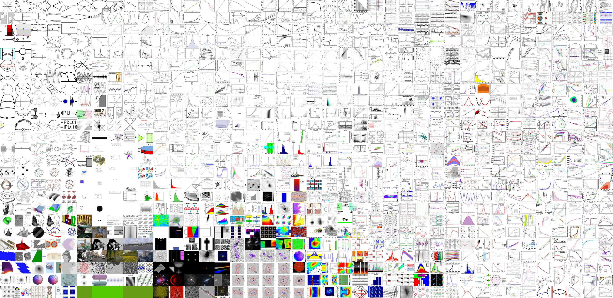

<h2>Table of Contents</h2>

<ul>
<li><a href="#sec-1">1. Re-imaging the empirical: statistical visualisation in art and science</a>
<ul>
<li><a href="#sec-1-1">1.1. Project Description</a></li>
<li><a href="#sec-1-2">1.2. Project Outline</a></li>
<li><a href="#sec-1-3">1.3. Code</a></li>
<li><a href="#sec-1-4">1.4. Project Methodology</a></li>
<li><a href="#sec-1-5">1.5. People</a></li>
<li><a href="#sec-1-6">1.6. Licence</a></li>
<li><a href="#sec-1-7">1.7. Credits</a></li>
<li><a href="#sec-1-8">1.8. Acknowledgements</a></li>
</ul>
</li>
</ul>

# Re-imaging the empirical: statistical visualisation in art and science

## Project Description

The increasing overlap of popular, scientific and aesthetic dimensions of visual culture with data analytical techniques is leading to a new kind of statistical visual culture. Yet there is scant literacy or understanding of statistical visualisation's role in empirical domains today. This research project aims to investigate how statistical images re-shape diverse knowledge domains and practices from facial recognition to medical diagnosis to video-tagging. Equally it will discern how arts-led visualisation transforms statistical image conventions and techniques. It aims to improve visual literacies and dialogue across communities of practice in art and science, and has the
potential to communicate the value and role of statistics today.

## Project Outline

-   Downloading and extracting the arXiv source dataset - see arxivextract.sh
-   Creating an SQLite database to index each image and link to metadata - sqlite-scripts
-   Querying dataset for various statistics regarding image formats, dimensions, category distributions etc. - see statistics, e.g. general data statistics
-   Running machine learning techniques such as image classification and dimensionality reduction across data
-   Producing t-SNE maps of the distribution of different image features within subsets of the data

t-SNE map of 1000 images from arXiv, organised by features extracted from VGG classifier

 from 2012 from arXiv, organised by features extracted from VGG classifier")
t-SNE map of images with the primary category of cs.CV (computer science, computer vision) from 2012 from arXiv, organised by features extracted from VGG classifier

-   Generating images using the image dataset using generative adversarial networks

## Code

This repository contains code, statistics, and images produced throughout the project. These materials are mostly concerned with looking at the dataset of all the images, text, and metadata contained within the [arXiv](arXiv.org) source files.

For detailed instructions on running the code, please look in the [methods](methods/) folder.

Code is written using bash, python, SQLite, jupyter, and anaconda. Tested on Ubuntu 18.04 with NVidia graphics card.

## Project Methodology

## People

-   Professor Anna Munster, UNSW Art & Design
-   Professor Adrian Mackenzie, Australian National University
-   Kynan Tan, Postdoctoral Fellow, UNSW Art & Design

## Licence

## Credits

Code uses examples from
-   Machine Learning for Artists [ML4A](https://ml4a.github.io)
-   Mario Klingemann's [RasterFairy](https://github.com/Quasimondo/RasterFairy)

## Acknowledgements

Project supported by an Australian Research Council Discovery Grant